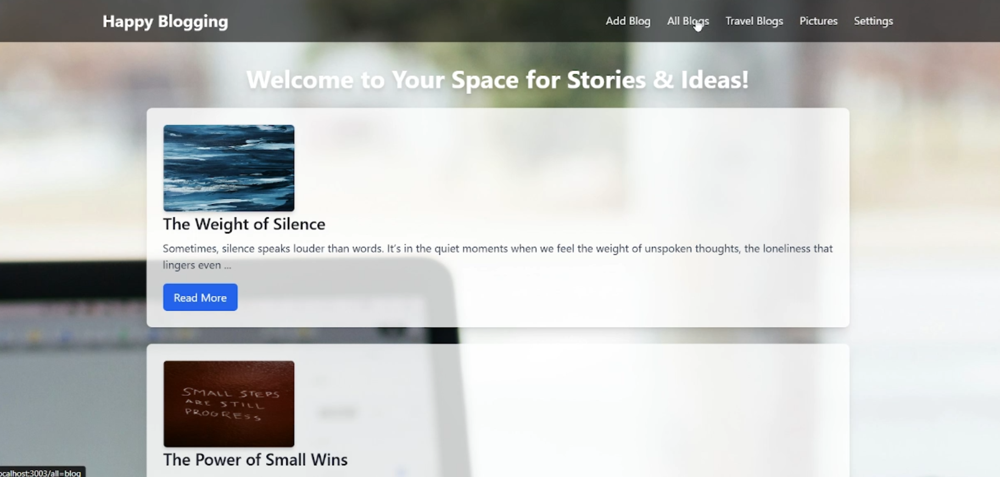
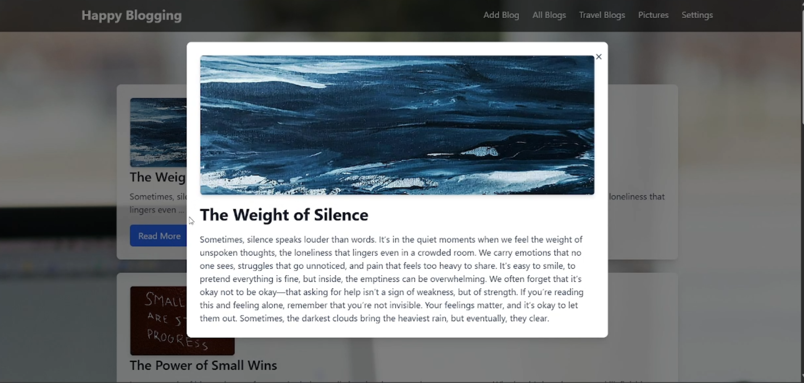
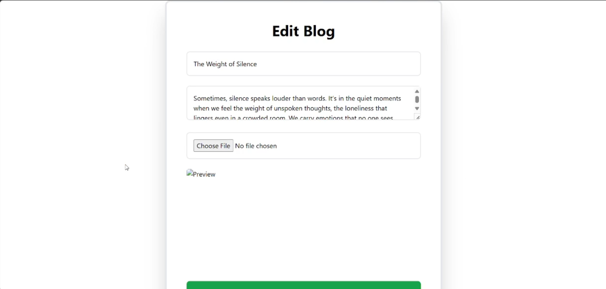
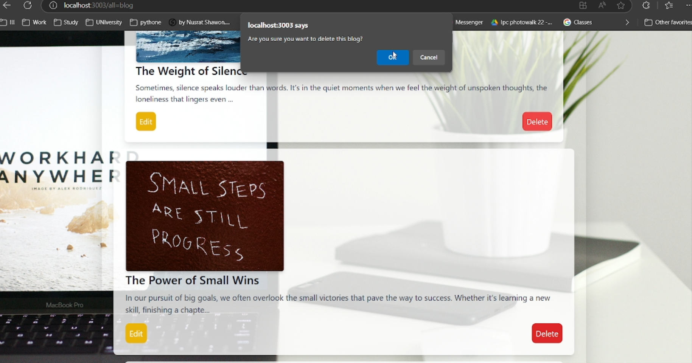

# 📝 MERN Blogging Website

A personal blogging platform built using the MERN stack (MongoDB, Express.js, React.js, Node.js). Users can sign up, log in, write blog posts, and view them on the dashboard. This is a full-stack web application with authentication and CRUD functionalities.

---

## 🚀 Features

- User Signup & Login (Authentication)
- Create new blog posts
- View all blog posts in dashboard
- MongoDB integration for data storage
- Responsive frontend with React
- RESTful API with Express and Node.js

---

## 📸 Screenshots

<!-- Add screenshots or a GIF here -->






---

## 🛠️ Tech Stack

**Frontend:**
- React.js
- React Router DOM
- react-modal
- Material UI Dialog
- headlessui (for Tailwind users)
- Axios

**Backend:**
- Node.js
- Express.js
- MongoDB with Mongoose
- Bcrypt (for password hashing)
- JSON Web Token (JWT) for authentication

---

## ⚙️ Setup Instructions

### 1. Clone the repository

```bash
git clone https://github.com/your-username/mern-blogging-website.git
cd mern-blogging-website
